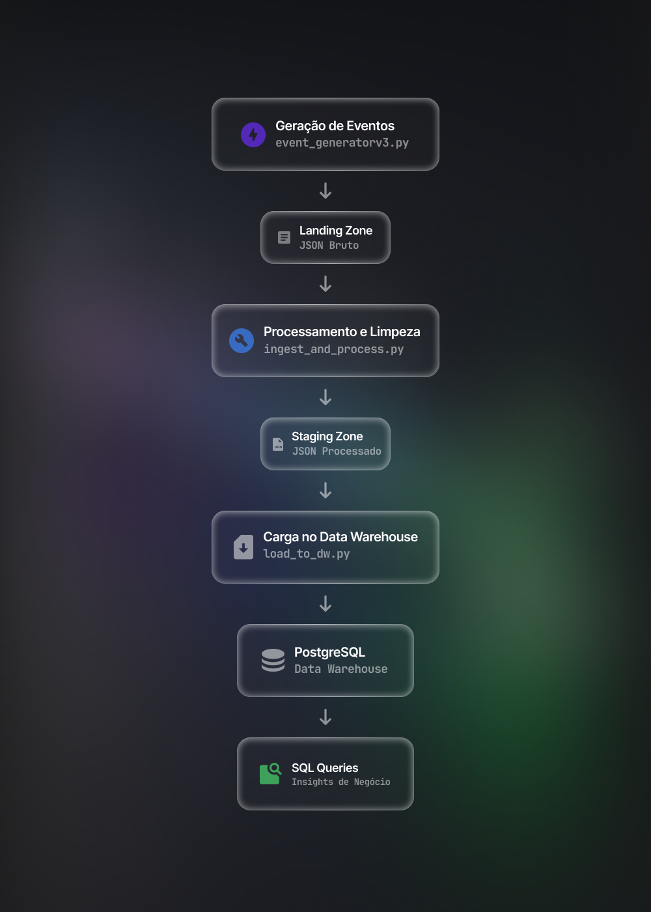
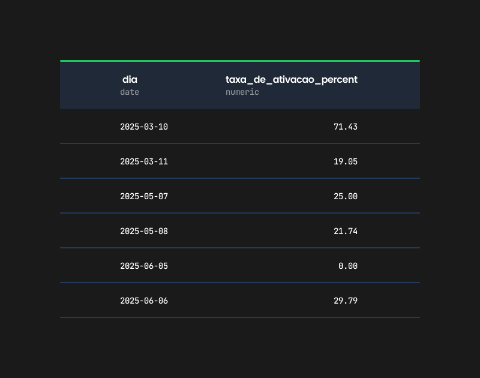
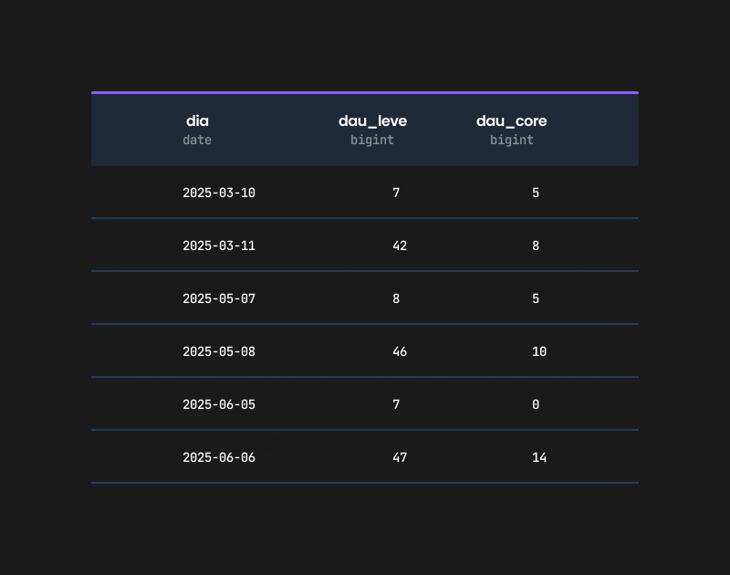

# 📊 Unframed Data Pipeline
Um Projeto Prático de Engenharia de Dados.

[](https://www.python.org/)
[](https://www.postgresql.org/)
[](https://github.com/alissonfluck/SEU_REPOSITORIO/releases)
[](LICENSE)


---

## 📑 Sumário
- [📊 Unframed Data Pipeline](#-unframed-data-pipeline)
  - [📑 Sumário](#-sumário)
  - [Resumo do Projeto](#resumo-do-projeto)
  - [Stack Tecnológica](#stack-tecnológica)
  - [Arquitetura do Pipeline](#arquitetura-do-pipeline)
  - [Objetivos de Negócio e KPIs](#objetivos-de-negócio-e-kpis)
    - [📈 KPIs Definidos](#-kpis-definidos)
    - [📊 Exemplos de Saída](#-exemplos-de-saída)
      - [Taxa de Ativação Diária (%)](#taxa-de-ativação-diária-)
      - [Comparativo de DAU Leve vs. DAU Core](#comparativo-de-dau-leve-vs-dau-core)
  - [Como Executar o Projeto](#como-executar-o-projeto)
    - [🔧 Pré-requisitos](#-pré-requisitos)
    - [📥 Clonar o repositório](#-clonar-o-repositório)
    - [📦 Instalar dependências](#-instalar-dependências)
    - [🔑 Configurar variáveis de ambiente](#-configurar-variáveis-de-ambiente)
    - [▶️ Executar Pipeline](#️-executar-pipeline)
  - [Decisões Técnicas](#decisões-técnicas)
  - [Próximos Passos](#próximos-passos)
    - [Licença](#licença)

---

## Resumo do Projeto
Este projeto foi construído para simular os desafios reais de um **Engenheiro de Dados**, desde a coleta até a análise, com foco em demonstrar boas práticas de **ELT** e gerar **KPIs acionáveis** para uma plataforma fictícia de streaming, a **Unframed**.

Trata-se de um **pipeline de dados end-to-end** que:
- Extrai eventos de interação do usuário  
- Carrega em um Data Warehouse  
- Transforma para análise e visualização de métricas de negócio  

---

## Stack Tecnológica
- **Linguagem:** Python 3.12.10  
- **Banco de Dados:** PostgreSQL (Data Warehouse)  
- **Bibliotecas Principais:**  
  - `psycopg` → conexão com o DB  
  - `Faker` → geração de dados  
  - `python-dotenv` → gerenciamento de segredos  
- **Arquitetura:** Pipeline **ELT** com Data Lake baseado em arquivos (JSON) e pastas de stages:  
  - `landing_zone`  
  - `processed_data`  
  - `archive`  

---

## Arquitetura do Pipeline
O fluxo de dados foi desenhado para ser simples, robusto e observável, seguindo as etapas clássicas de um pipeline de dados.  



---

## Objetivos de Negócio e KPIs
Este pipeline transforma dados brutos em insights para responder perguntas críticas de negócio.

### 📈 KPIs Definidos
- **DAU (Daily Active Users)**  
  Contagem de usuários únicos que realizaram eventos no dia.  
  *Mede engajamento e base ativa da plataforma.*  

- **Taxa de Conversão**  
  `(Usuários criaram conta / Visitantes únicos) * 100`  
  *Avalia eficiência do funil de aquisição.*  

- **Taxa de Ativação**  
  `(Novos usuários que deram play / Total de novos usuários) * 100`  
  *Verifica se usuários estão extraindo valor logo após cadastro.*  

- **Funil de Login**  
  Eventos `login_succeeded` vs `login_failed`  
  *Identifica atritos ou falhas na autenticação.*  

---

### 📊 Exemplos de Saída

#### Taxa de Ativação Diária (%)


<details>
<summary>📜 Query SQL da Taxa de Ativação</summary>

```sql
WITH signups_by_day AS (
    SELECT DISTINCT
        CAST(envelope_eventtimestamp AS DATE) AS signup_date,
        payload_userid
    FROM user_created
),
playbacks_by_day AS (
    SELECT DISTINCT
        CAST(envelope_eventtimestamp AS DATE) AS playback_date,
        payload_userid
    FROM playback_started
)
SELECT
    s.signup_date AS dia,
    ROUND(
        (CAST(COUNT(p.payload_userid) AS NUMERIC) / NULLIF(CAST(COUNT(s.payload_userid) AS NUMERIC), 0)) * 100.0,
        2
    ) AS taxa_de_ativacao_percent
FROM
    signups_by_day s
LEFT JOIN
    playbacks_by_day p ON s.payload_userid = p.payload_userid AND s.signup_date = p.playback_date
GROUP BY
    s.signup_date
ORDER BY
    s.signup_date ASC;
```
</details>

---

#### Comparativo de DAU Leve vs. DAU Core


<details>
<summary>📜 Query SQL DAU Leve vs. Core</summary>

```sql
WITH dau_leve AS (
    SELECT
        CAST(envelope_eventtimestamp AS DATE) AS dia,
        COUNT(DISTINCT payload_userid) AS total_users
    FROM (
        SELECT envelope_eventtimestamp, payload_userid FROM user_created
        UNION ALL
        SELECT envelope_eventtimestamp, payload_userid FROM login_succeeded
        UNION ALL
        SELECT envelope_eventtimestamp, payload_userid FROM playback_started
    ) AS all_events
    GROUP BY dia
),
dau_core AS (
    SELECT
        CAST(envelope_eventtimestamp AS DATE) AS dia,
        COUNT(DISTINCT payload_userid) AS total_users
    FROM playback_started
    GROUP BY dia
)
SELECT
    dl.dia,
    dl.total_users AS dau_leve,
    COALESCE(dc.total_users, 0) AS dau_core
FROM
    dau_leve dl
LEFT JOIN
    dau_core dc ON dl.dia = dc.dia
ORDER BY
    dl.dia ASC;
```
</details>

---

## Como Executar o Projeto

### 🔧 Pré-requisitos
- Python 3.8+  
- PostgreSQL instalado e rodando  
- Banco de dados criado (`unframed_dw`)  

---

### 📥 Clonar o repositório
```bash
git clone [URL_DO_SEU_REPOSITORIO]
cd [NOME_DA_PASTA_DO_PROJETO]
```

### 📦 Instalar dependências
```bash
pip install -r requirements.txt
```

### 🔑 Configurar variáveis de ambiente
Crie um arquivo chamado `.env` na raiz do projeto e adicione suas credenciais:

```ini
# Arquivo: .env
DB_USER="seu_usuario"
DB_PASSWORD="sua_senha"
DB_HOST="localhost"
DB_PORT="5432"
DB_NAME="unframed_dw"
```

⚠️ **Importante:** adicione o `.env` ao `.gitignore` para não expor suas credenciais.

---

### ▶️ Executar Pipeline
1. **Gerar dados brutos na `landing_zone`**
   ```bash
   python event_generatorv3.py
   ```

2. **Transformar dados para `processed_data`**
   ```bash
   python ingest_and_process.py
   ```

3. **Carregar dados no PostgreSQL**
   ```bash
   python load_to_dw.py
   ```

---

## Decisões Técnicas
- **Geração de Dados** (`event_generatorv3.py`)  
  Simulação realista de personas (para garantir que a lógica de "costura" de IDs fosse testada com dados coerentes, simulando jornadas reais de conversão), enriquecimento de URLs, controle temporal.

- **Transformação** (`ingest_and_process.py`)  
  Gerenciamento de estado, para garantir que o pipeline pudesse, no futuro, lidar com múltiplos arquivos de forma idempotente, sabendo o que já foi processado, além disso, flattening de JSON para maior clareza.

- **Carga** (`load_to_dw.py`)  
  Gerenciamento seguro de segredos via `.env`, carga com estratégia de *full refresh* para a simplicidade do MVP.

---

## Próximos Passos
- Orquestração com **Apache Airflow**  
- Migrar para **Data Warehouse em nuvem** (BigQuery, Snowflake)  
- Adicionar **testes de qualidade de dados** (dbt, Great Expectations)  

---

### Licença

MIT License © 2025 Alisson Fluck